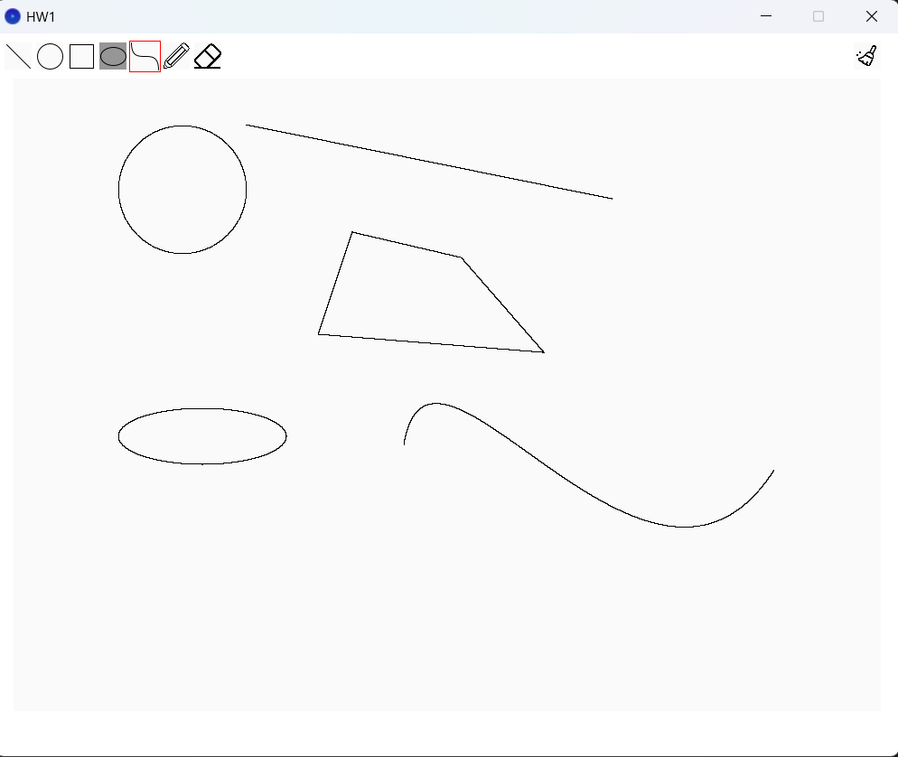
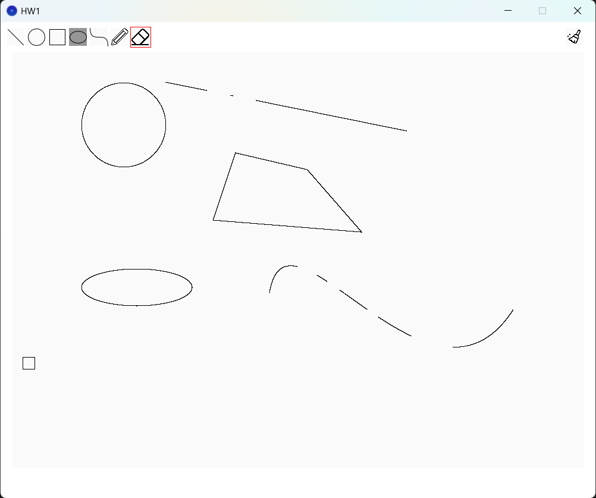

## ComputerGraphics_Lab1

# which tasks you have completed
I have completed a line algorithm, a circle algorithm, an ellipse algorithm, a Bézier curve algorithm, and an eraser function.

# some screenshots of your work

# how you completed these tasks
I have completed the tasks with some assistance of LLMS to help me deal with grammar problems.
I completed the bezier curve task refering this site:https://isinsu-atay.medium.com/understanding-cubic-bezier-curves-with-python-a-simple-guide-5710abe4905c.